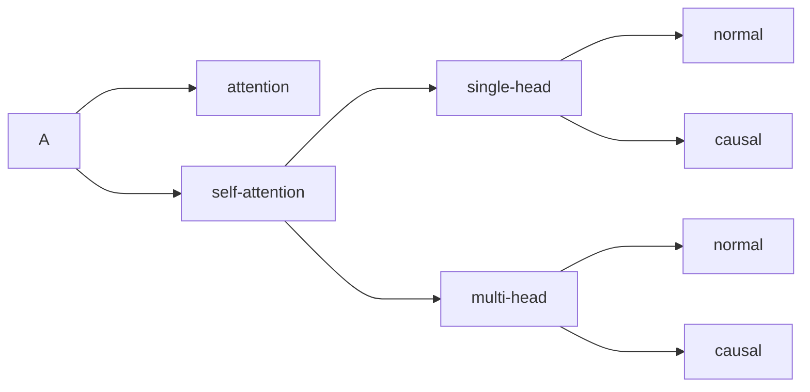

## attention

注意力机制，最早是在机器翻译论&#x6587;**[Neural Machine Translation by Jointly Learning to Align and Translate](https://arxiv.org/abs/1409.0473)**中提出来的，他的核心是，用一个东西产生的query，去key/value中查询需要的东西。在上述论文中encoder-decoder attention的结构中。

```
Q来自于decoder
K,V来自于encoder
```

decoder 当前正在生成目标语言词，它用自己的 query 去源语言句子的 encoder 表示里查找相关信息。

只要Q、K、V来自于不同的地方，就是attention机制。

### attention的本质

实际上attention就是根据相关性对信息进行**分配权重**，在**加权汇总**。

他不是让模型一整个平均的去看信息，而是让模型知道什么更重要，什么没那么重要，重要的多看一点。

数学上就是这样表示：

```
1. 用 Query 和 Key 算相关性分数
   score = QK^T
2. 用 softmax 把分数变成权重
   weights = softmax(score)
3. 用这些权重对 Value 做加权求和
   output = weights · V
```

## self-attention

区别于attention，自注意力机制的Q、K、V都是来自于同一个source。

$$
Q=X W_q \\
K=X W_k \\
V=X W_v
$$

上面公式中的X就是source，Q、K、V都是从X得到的。

### self-attention的本质

**让序列中的每个位置，根据自身内容，动态地从同一序列的所有位置中取信息。**

根据上面计算得到的Q、K、V，让每一个token的Q和其他所有的token的K都计算一遍相似度

$$
score = Q K^T \sqrt{d_k}
$$

再根据权重值，得到输出：

$$
output=softmax(score)V
$$

上述公式是论&#x6587;_[attention is all you need](https://arxiv.org/abs/1706.03762)_&#x4E2D;的，其中的$d_k$分别是是K的维度（dimension）。作用是防止计算得到的score过于大，导致经过softmax之后过分尖锐（一个位置的权重无限接近于1，其余位置无限接近于0，训练效果差），或者说，除以$d_k$是为了防止进入softmax的饱和区，导致梯度消失。神经网络更新参数是需要根据梯度变化来更新的。

$$
\frac{\partial p_i}{\partial z_i} = p_i(1 - p_i)
$$

### causal self attention

是一种带因果罩的self-attention。即判断当前token是否能看见，未来token，比如`我 喜欢 大 模型 `

对于`喜欢`这个token，就无法看见`大` `模型`这两个token，在处理`喜欢`这个token的时候，就会给他后面的token添加一个causal mask，把未来的attention score设置为-inf，因为此处的softmax是0。

对于生成式（GPT）的任务，通常需要从左往右输出下一个token，如果在训练时没有遮蔽未来token，相当于就是让模型提前知道了答案，训练loss很好看，但是模型能力并没有得到训练，所以对于GPT这种自回归语言模型必须要有causal mask。

而对于理解型任务，比如情感分析，文本填空，则需要双向self attention，要理解整句话，比如下面的例子

```
这部电影前半段无聊，但结尾非常震撼。
```

判断情感时，“无聊”应该能看到后面的“但结尾非常震撼”，否则理解会偏。BERT 这类模型就通常用普通双向 self-attention，可以看左右两边。

### 添加位置编码

self-attention虽然考虑了所有的输入变量，但是并没有考虑每个变量处于**序列中的位置**。

比如，`我 爱 你`和`你 爱 我`就是两组序列，原本的self- attention只关心他们每个词的相关性，不在乎顺序，但很明显这两组序列想表达的意思是绝对不一样的。

于是便有了添加位置编码来明确每个输入变量（token）的位置。图片中的e就是位置编码。


- 注意：位置编码的计算不是直接根据token的位置1，2，3，4得到的，主要有两种逻辑，一种是根据公式计算，&#x50CF;_[attention is all you need](https://arxiv.org/abs/1706.03762)_&#x4E2D;的sin/cos位置编码就是通过公式计算到的；另一种是可学习的位置编码，比如：$P_{position} ∈ R^{(max_{len} × d_{model})}$，训练不光得到Wq、Wk、Wv，还会得到这个位置编码的计算方式。

### multi-head attention

是指不是指用一套Q、K、V来去看上下文，而是用多套Q、K、V去看。

比如有8个head：

$$
head_1: Wq_1, Wk_1, Wv_1\\
head_2: Wq_2, Wk_2, Wv_2\\
...\\
head_8: Wq_8, Wk_8, Wv_8\\


$$

对于每个head，都回去计算一遍output：

$$
Q_i = XWq_i\\
K_i = XWk_i\\
V_i = XWv_i\\
\\
head_i = softmax(Q_i K_i^T \sqrt{(d_k)})V_i\\
$$

再把每个head都concat起来。

$$
concat = [head_1; head_2; ...; head_h]
\\
output = concat * W_o


$$

最终的到新的输出。

- 为什么要有多头注意力：因为一个 attention head 的表达能力有限。多头相当于让模型同时提出不同问题。

比如：小明把苹果放进书包，因为它很甜。对于不同的head就会关注不同的关系

```
head 1：关注“它”指代谁
head 2：关注形容词“甜”和名词的关系
head 3：关注局部相邻词
head 4：关注主谓宾结构
```

下图中的h就是head的数量。


对于多头注意力机制，训练得到的参数在前面的基础上，又增加了$W_o$，它负责把各个 head 看到的东西怎么合并。

$$
W_o ∈ R^{(h * d_v × d_{model})}


$$



---

## test：

Q1：Q、K、V 分别来自哪里？为什么不是直接用输入向量两两算相似度？

A1：Q、K、V都是通过对embedding的数据分别其乘上其对应的权重系数得到的，比如Q=Wq\*X；因为attention机制就是为了根据相关性对信息来分配权重，而直接两两相乘，忽略了相关性，效果不好。

Q2：attention score 为什么要除以sqrt(d_k)

A2：因为如果不除去这个K的维度开方，权重值会偏大，导致softmax容易进入饱和区，从而导致梯度消失，而神经网络的训练都是根据梯度来变化来更新参数的。

Q3：softmax 后的 attention weights 表示什么？

A3：每个token的Q和K求得的相似度，也就是这个token在全文中的权重。

Q4：self-attention 相比 RNN/CNN，核心优势和代价分别是什么？

A4：参见[Self-Attention、RNN、CNN 核心对比](https://affine.somnus.top/workspace/09e2838e-0333-4d5c-80d5-bcae278e8e50/BPPtOP8gag7NYk-SFtleQ)

Q5:causal self-attention 和普通 self-attention 差在哪里？
A5:causal self-attention 没有学到

---

A1:小修正：不是“直接两两相乘忽略了相关性”，直接用输入向量做相似度其实也能算相关性，但表达能力弱。引入Wq/Wk/Wv的意义是让模型学会三种不同角色：

- Q：当前 token 想找什么信息
- K：每个 token 能被别人匹配的特征
- V：真正被加权汇总的信息内容

A3：Q3 需要再精确一点。softmax 后的 attention weights 表示：**对某一个 query token 来说，它应该从各个 key/value token 那里取多少信息**。不是“这个 token 在全文中的权重”，而是“这个 token 看其他 token 的分配比例”。

A4：补上：

- 相比 RNN：self-attention 可以并行处理序列，而且任意两个 token 的交互路径更短；RNN 要一步步传递，长距离依赖容易衰减。
- 相比 CNN：self-attention 可以直接建模任意位置之间的关系；CNN 依赖卷积核和层数扩大感受。
- 代价：标准 self-attention 的计算和显存复杂度是O(n^2)，序列越长越贵。

A5：causal self-attention 是 decoder / 自回归生成里用的。它和普通 self-attention 的区别是：**当前 token 只能看自己和它左边的 token，不能看未来 token**。

比如句子：

`我 喜欢 大 模型 `

生成“喜欢”时，只能看“我”和“喜欢”，不能偷看后面的“大 模型”。实现上会加一个 causal mask，把未来位置的 attention score 设成-inf，softmax 后权重就是 0。
