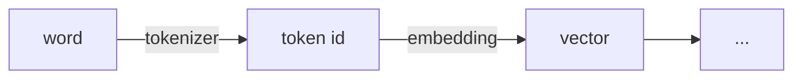
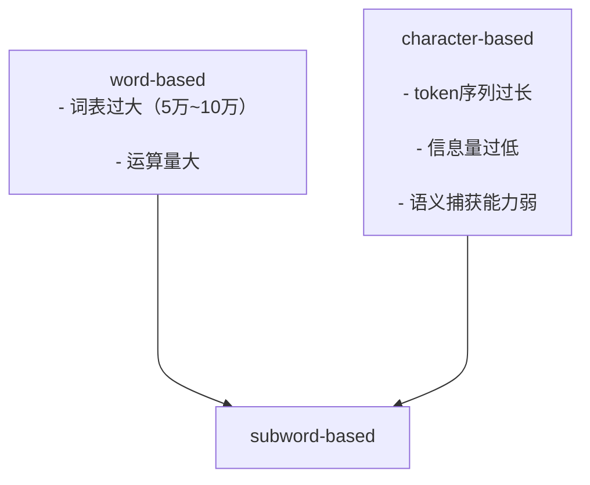
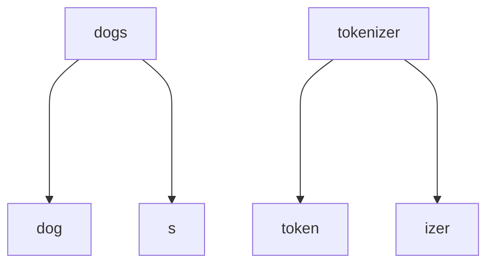
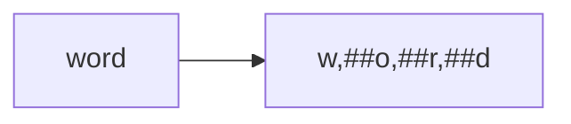

## 为什么要有tokenizer

tokenizer的作用是把文本序列转换成数字序列，即token编号，作为transformer的输入。



## word-based tokenizer

将文本分成一个个词，优点是表达意思准确，但是问题是很容易把同一个意思的词分成很多类，比如cat和cats就会被分成两类，按照这样的编码方式，就会导致词表巨大，因此就需要巨大的embedding_matrix，导致空间复杂度和时间复杂度大幅上升。

如果限制词表的大小，比如把词表上限设为10000，就会出现很多词都无法覆盖的情况，模型性能会很差。

## character-based tokenizer

按照每个字母来分词，比如`"cat"`就被分为`'c','a','t'`，优点是很容易表示英文，对于英文总共可能只需要256个序号来表示，对于任意文本都不会出现unknown的现象。
缺点也是显著的，

1. 每个字母没办法代表很多的含义，信息量太低了，导致模型性能也会很差；

2. 对于中文还是需要很大的词表；

3. 相对于word-based，token序列会过于长。

## subword-based tokenizer



可以看到上述两种方法都有自己的缺点，而subword就是一种折中的方法。
subword划分更符合英文词群，能充分表达词意。



### BPE

即byte-pair encoding，主要分成两部分，词频统计和词表合并。
首先先把所有的词按character切分，得到单词表，再所有词中的两两组合的单词组合统计频率，根据频率从高到低排，取出频率最高的那个两个单词的组合，把它加到词表中。然后再按照新的词表的词两两组合（此时会有三个单词组成词组），再统计频率，再将最高频率的词组加到词表中，以此循环，知道达到超参数设定的最大循环次数。

具体流程可以看这个[视频](https://www.bilibili.com/video/BV1Fc411C7sz/)。
BPE的超参数是设定最大循环次数。

- BBPE即byte level BPE，即把每个字节视作基本的token，两个字节就可以合并表示Unicode，比如中文，阿拉伯文，表情符号。

### WordPiece Tokenization

大体是和BPE类似的，但是除了第一个字母，会添加##作为前缀



使用联合概率来计算每个pair的得分。
$$pair得分=\frac{pair出现的次数}{token1出现的次数 \times token2出现的次数}$$
证明这个wordpiece方法他会优先考虑单一token在词表中**并不频繁**的，将其合并起来。
比如unable的`un`、`##able`和hugging的`hu`、`##gging`，后者会更容易合并起来。

### Unigram tokenization

首先是获得一个很大的词表，然后在尝试删除这个词表中的某个词，然后计算他的unigram loss。删除p%使得loss增加最少的token。

- 前提：假设每个词的出现都是独立的。
  unigram loss计算公式
  $$
  Unigramloss=\sum frec(-log(P(word)))
  $$
  其中的frec是这个词出现的频率，P(word)是这个词出现的概率。
- unigram是通过不断的迭代知道词表缩小到预设值。
- 为单词的每种划分算法非常耗时，采用更高效的维特比算法。

### sentencePiece tokenization

- BPE、WordPiece、Unigram的缺点
  中文，韩文，日文等语言并不是通过空格来分词的。
  对于特定语言可以使用pre-tokenization，但是不通用。
- SentencePiece tokenization
  将输入视为输入字节流，包括空格。
  然后再使用byte-level BPE或unigram算法来构建适当的词汇表。
- unigram算法经常在sentence piece中使用，是AIBERT、T5、mBART、BigBird和XLNet使用的算法。

## Q&A

1. token是一个词，token_id是这个词对应的数字，vocabulary是词表，就是所有词的汇总。
2. 因为如果直接按词处理的话，会出现太多的意思相近的词，比如dog和dogs就会被认为是两个词，词表会过大
3. 按字符划分的话，词表的大小会小很多，但是每个字符的表意并不够丰富，导致模型效果会不好。
4.
5. BPE的基本思想是词频统计和词表划分。
6. 不知道

你这节已经有骨架了，差的是把几个概念说得更精确。逐题修一下。

1. **token / token id / vocabulary**
   token 不一定是“一个词”。它可以是一个字、一个词、一个词片段、一个标点、一个空格片段，甚至代码里的符号片段。

   更准确地说：
   - `token`：tokenizer 切出来的最小处理单元
   - `token id`：这个 token 在词表里的整数编号
   - `vocabulary`：token 到 id 的映射表

2. **为什么不直接按词处理**
   你说的 `dog/dogs` 是对的，但还要补两个更关键的问题：
   - 词表会巨大，尤其中文、英文变形、专有名词、拼写错误、代码、URL 混在一起时。
   - 会有 OOV，也就是词表外词。遇到没见过的新词、人名、产品名，就没法稳定表示。

3. **为什么不完全按字符处理**
   对。再补一个核心代价：序列会变得很长。

   比如 `transformerization` 按字符可能十几个 token，按 subword 可能 3-4 个 token。序列越长，attention 成本越高，上下文窗口也越容易被占满。

4. **subword tokenizer 的核心折中**
   这题可以这样答：

   > 高频词或常见片段尽量作为完整 token，低频词、生造词、专有名词拆成更小的子词片段。

   好处是：词表不会无限大，同时也不容易 OOV，序列长度也比字符级短。

5. **BPE 的基本思想**
   你的答案方向对，但还不够具体。BPE 可以这样理解：

   > 从字符级开始，反复统计最常一起出现的相邻片段，把它们合并成新的 token，直到达到目标词表大小。

   举例：

   ```text
   l o w
   l o w e r
   n e w e s t
   ```

   如果 `l` 和 `o` 经常相邻，就合并成 `lo`；如果 `lo` 和 `w` 经常相邻，就合并成 `low`。

6. **tokenizer 怎么影响上下文长度和计费**
   大模型按 token 处理上下文，很多 API 也是按 token 计费。

   所以 tokenizer 会影响：
   - 同一段文字会被切成多少 token
   - 能塞进上下文窗口的内容有多少
   - 输入/输出成本是多少
   - 长文本、中文、代码、多语言混合时的实际效率

   例子：如果一个 tokenizer 对中文切得很碎，同样一篇中文文章 token 数更多，就更贵，也更容易超过上下文长度。
